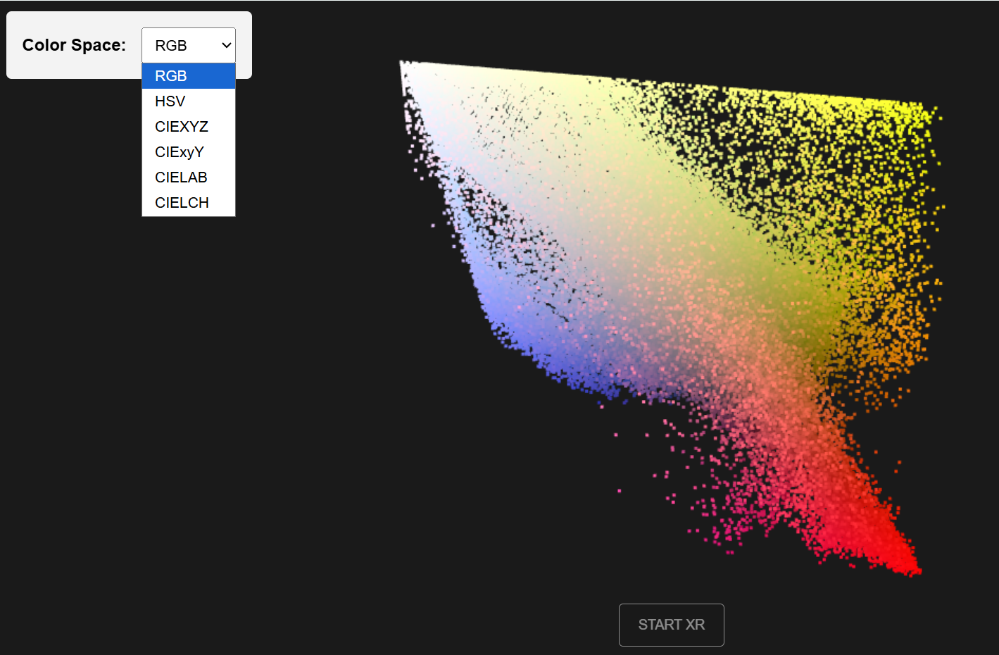

# Real Time 3D XR Visualization Project, Shaders and Color Sciences

This project was developed for the 3D Visualization course and focuses on shader-based visualization of color information using Three.js, GLSL, and WebXR.

The goal of the practical work is to create complete interactive applications that visualize color distributions extracted from an image (or video), explore multiple color spaces, generate elevation maps from selected color components, apply Lambertian directional lighting, and make the visualizations accessible in VR/MR using the WebXR API.

## Technologies Used

* Three.js
* GLSL shaders (custom vertex and fragment shaders)
* WebGL
* WebXR API
* XRButton
* HTMLMesh
* InteractiveGroup
* OrbitControls
* JavaScript (ES6 modules)

## Implemented Color Spaces

The following six color spaces were implemented and can be selected interactively:

* RGB
* HSV
* CIEXYZ
* CIExyY
* CIELAB
* CIELCH

Color conversion functions were implemented directly inside GLSL shaders for real-time visualization.

# Exercise 1 — Color Space Point-Cloud Visualization

This exercise visualizes the color distribution of an input image as a 3D point cloud.
Each pixel of the source image is converted into a point in 3D space.
Its position depends on the selected color space coordinates, while the original RGB color is preserved for rendering.
The user can switch between all six color spaces and observe how the same image is distributed differently in each representation.
To improve XR performance, point cloud sampling was reduced by skipping pixels instead of rendering one point per pixel.

### Main features

* shader-based point cloud rendering
* image and optional video input support
* interactive color space selection
* optimized point count for WebXR

## Example Result



# Exercise 2 — Color Elevation Maps

This exercise creates elevation maps (heightfield surfaces) from image color information.
For every pixel `(u, v)` of the source image, one selected color component is used as height:
z = h(u, v).
The user can choose:
* color space
* component (for example R/G/B, H/S/V, L/a/b)
* height scale
* display mode (original image color or grayscale height view).
This allows spatial visualization of how a single color channel varies across the image.

### Main features

* PlaneGeometry subdivided into image-based grid
* vertex shader displacement using selected color component
* interactive height scaling
* multiple display modes

# Exercise 3 — Lambertian Directional Lighting on Elevation Maps

This exercise improves the depth perception of Exercise 2 by adding directional Lambertian lighting.
The surface normal is estimated using neighboring height samples (left, right, up, down) from the heightfield.
The Lambertian diffuse term is computed using:
max(0, N · L)
where:
* N = surface normal
* L = light direction.
Ambient and diffuse lighting are combined to improve the perception of 3D shape and surface relief.

### Main features

* normal estimation from neighboring height samples
* Lambertian diffuse lighting
* ambient + diffuse light controls
* interactive lighting parameter adjustment

# WebXR / VR / MR Support

All three exercises were made accessible in XR using the WebXR API.

Implemented features include:

* XRButton for entering XR sessions
* controller support
* controller models
* HTMLMesh panels for interactive UI inside XR
* renderer.setAnimationLoop() for XR rendering
* object repositioning in front of the user during XR sessions

Due to the absence of a physical headset, full immersive testing was limited, but the WebXR pipeline and XR interaction flow were implemented and tested using browser-based tools.

# Project Structure

```text
Real-Time-3D-XR-Visualization-Project-Shaders-and-Color-Sciences/
│
├── Ex1_colorspacepointcloud.html
├── Ex2_colorelevationmaps.html
├── Ex3_lambertiandirectionallighting.html
│
├── js/
│   └── shaderscolorsciences.js
│
├── assets/
│   ├── image.png
│   └── paris.jpg
│
└── README.md
```

# Notes

The shared file `shaderscolorsciences.js` contains reusable helper functions for:

* scene creation
* resize handling
* WebXR setup
* color space selector UI
* texture loading
* color conversion GLSL functions
* component selection GLSL helpers

This helped reduce code duplication between exercises and kept the project structure cleaner.
